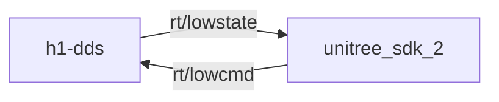

# h1 DDS

Mock communications with h1's low-level rt/lowstate and rt/lowcmd DDS channels, as sent and received by [Unitree's SDK2](https://github.com/unitreerobotics/unitree_sdk2).

Future plans include creating a [Gazebo](https://gazebosim.org/) plugin to simulate the h1 robot, allowing real and simulated environments to run the same business logic code.
