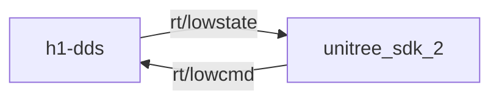

# h1 DDS

Mock communications with h1's low-level rt/lowstate and rt/lowcmd DDS channels, as sent and received by [Unitree's SDK2](https://github.com/unitreerobotics/unitree_sdk2).


```mermaid
flowchart LR
    h1dds[h1-dds] -->|rt/lowstate| sdk2[unitree_sdk_2]
    sdk2 -->|rt/lowcmd| h1dds
```

## gz-unitree

A [Gazebo](https://gazebosim.org/) plugin to that bridges to the Unitree SDK2.

See [gz-unitree](./gz-unitree/).

### Installation & launch

```bash
git clone https://github.com/gepetto/h1-dds --recurse-submodules
cd h1-dds/gz-unitree
mkdir build && cd build
cmake ..
make
GZ_SIM_SYSTEM_PLUGIN_PATH=$(realpath .) gz sim ../gz_gepetto_humanoids_models/h1_2/h1_2_with_ground.sdf
```

You can then send commands to the robot using DDS, on the `rt/lowcmd` channel, domain 1.
You'll get back the state on the `rt/lowstate` channel, domain 1.

For example, [unitree_sdk2's H1-2 low-level demo](./unitree_sdk2/example/h1/low_level/h1_27dof_example.cpp) works (you just have to change the DDS domain to 1, it's hardcoded to 0).
